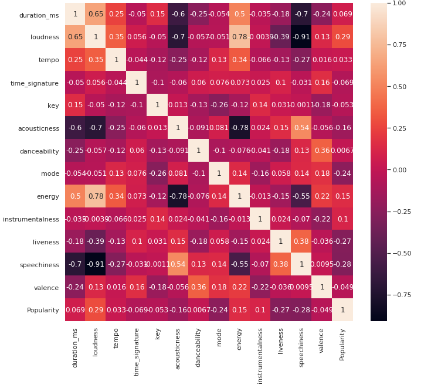

I have been listening to 21 pilots for past 4-5 years. Their songs provide me motivation to just go through my day. They have a huge fan base. Some songs do resonate with some people more than others. In this project, I hope to analyze various factors that affect the popularity of a 21 pilots album track.

To my luck, spotify provides a structured api to fetch details about almost any artist. Along with that, it also keeps track of features like danceability, energy etc. for each track. We are going to see which of those features contribute the most towards the popularity of a track. This result will be indicative of which factors resonate more with the fan base of 21 pilots, and can even help describe certain attributes about the fans themselves.

# Tools used:
- Python ML ecosystem (Pandas, Sklearn, Numpy) : To perform data processing
- [Spotipy API](https://github.com/plamere/spotipy) : To fetch spotify data

# Results:
# Heat map depicting relationship between various mmusical features:

